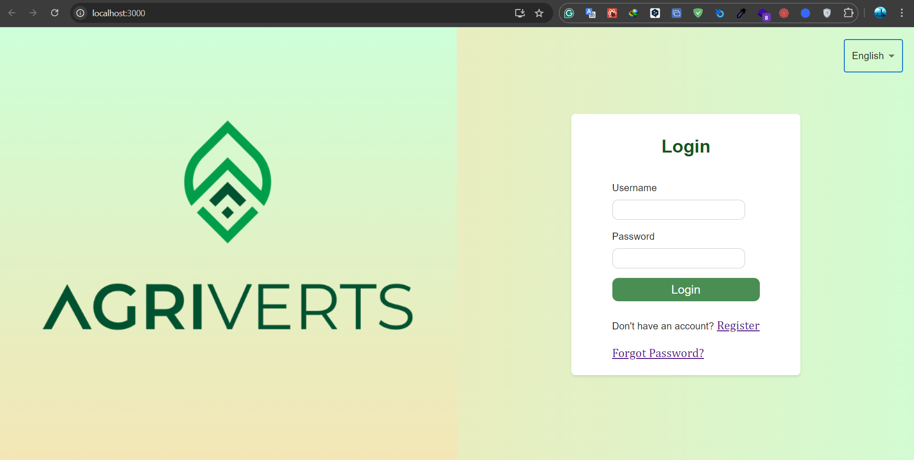
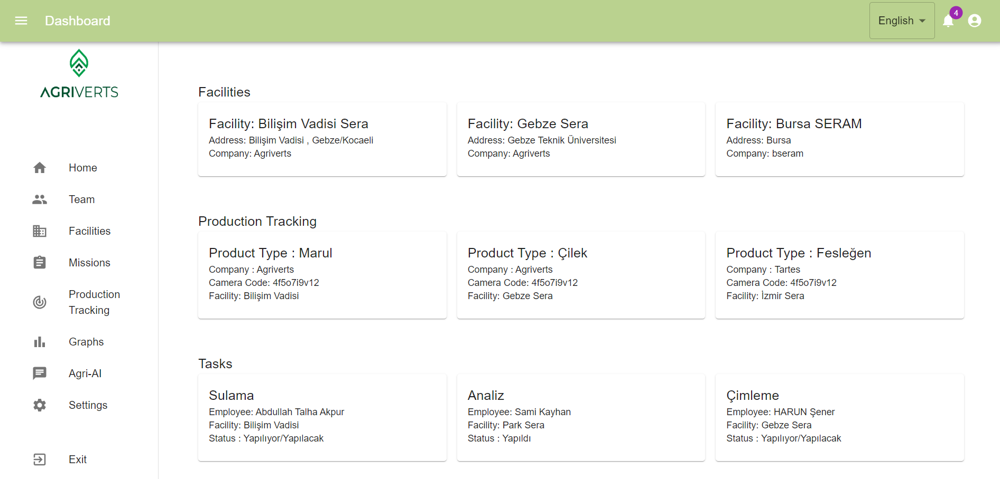
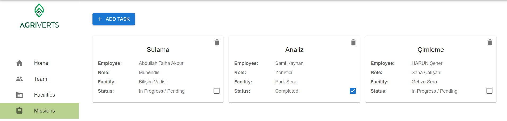
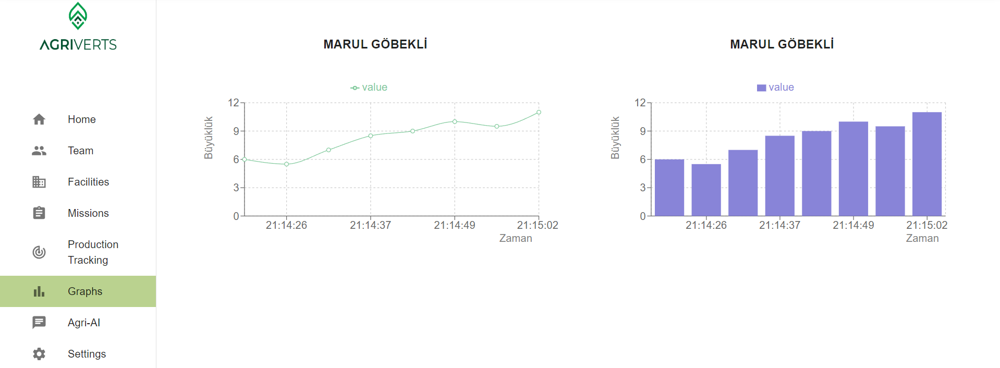
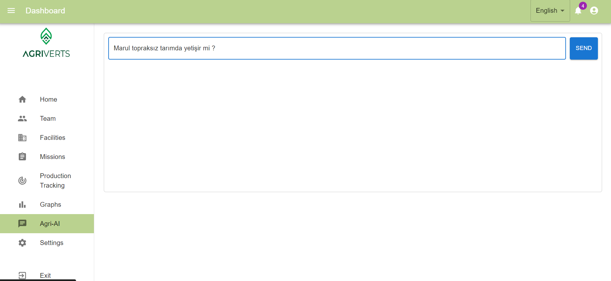

# SaasRPlatform React Functional

This repository contains the frontend part of the SaasRPlatform. SaasRPlatform, React işlevsel bileşenleri kullanılarak oluşturulmuş bir yazılım hizmeti platformudur.Agriverts firmasının arayüzünü geliştirdim. React,Node,Material Uİ kullandım ve çoklu dil yapısı için i18n kullandım.

## Features

- **User Authentication:** Kullanıcı kimlik doğrulama işlevselliği sağlar.
- **Dashboard with Data Visualization:** Veri görselleştirmesi ile birlikte kullanıcı paneli.
- **User Management:** Kullanıcı yönetimi için işlevsellik.
- **Subscription Management:** Abonelik yönetimi için işlevsellik.
- **Integration with SaasRPlatform Backend API:** SaasRPlatform arka uç API'siyle entegrasyon sağlar.

## Technologies Used

- **React:** Kullanıcı arayüzü oluşturmak için kullanılan bir JavaScript kütüphanesi.
- **Redux:** Durum yönetimi için kullanılan bir JavaScript kütüphanesi.
- **React Router:** Uygulama rotalarını tanımlamak için kullanılan bir React kütüphanesi.
- **Material-UI:** Kullanıcı arayüzü bileşenleri oluşturmak için kullanılan bir React kütüphanesi.
- **Axios:** HTTP istekleri yapmak için kullanılan bir JavaScript kütüphanesi.

  ## React Dashboard Project
  This is our login page which i designed by myself

  

  ## Dashboard Home
  This is our Home Page

   

   ## Missions
  This is our Missions Page

  

  ## Graphs
  This is our Graphs Page

   

  ## Chatbot
  This is our Special Chatbot

   

## License

Bu proje MIT Lisansı ile lisanslanmıştır. Ayrıntılar için [LICENSE](LICENSE) dosyasına bakın.
